# sql

#### ddl


##### 1.表操作


创建:


查询:


修改:

这个是表内的


这个是表名字的


删除:

两种


第一种直接删除

第二种删除数据

##### 总结


#### dml

##### 增

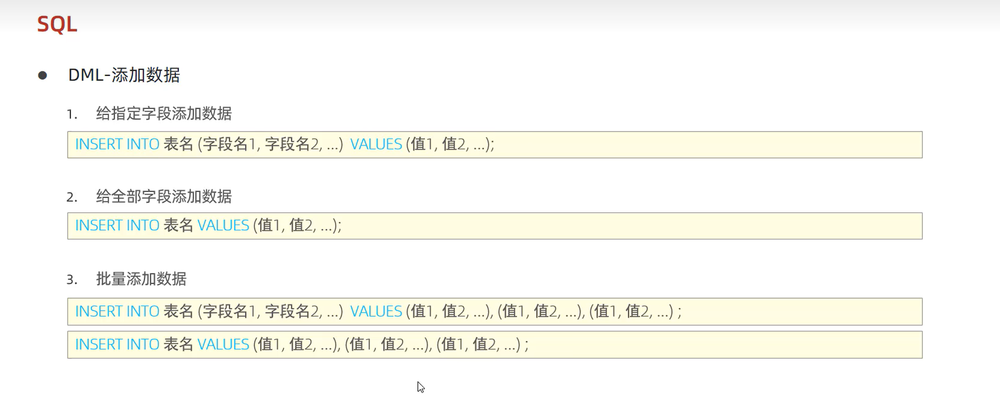

##### 删

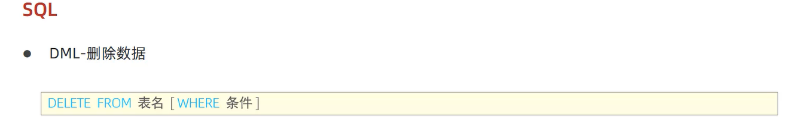

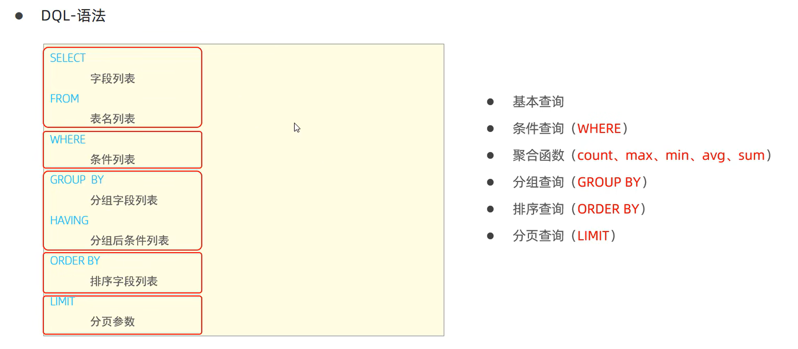

#### dql-

##### 基本查询:

1.查询多个字段

2. 设置别名
3. 去除重复记录

```mysql
-1.查询指定字段,name,workno,age,返回
SELECT name,workno,age FROM emp1;
--2.查询返回所有字段
SELECT id,workno,name,age,idcard,workaddress,entrydata FROM emp1;
--或者
SELECT *from emp1;
--查询所有公主地址
SELECT workaddress as '公主地址' from emp1;
--不重复的//去除重复的;
SELECT DISTINCT workaddress '公主地址' from emp1;
```


##### 条件查询where

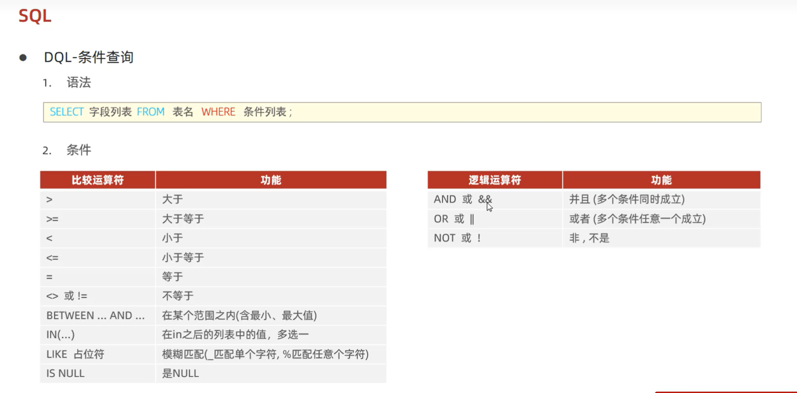

```mysql
--1.查询年龄等于88的员工
select * from emp where age =88;
--1.查询年龄小于20的员工
select * from emp where age <20;
--1.查询年龄小于等于20的员工
select * from emp where age <=20;
--4.查询没有身份证的员工
SELECT *from emp1 where null;
--4.查询有身份证的员工
SELECT *from emp1 where is not null;
--1.查询年龄bu等于88的员工
select * from emp where age !=88;
select * from emp where age <>88;
--1.查询年龄在15和20之间的员工
SELECT 8 from emp1 where >=15&&age<=20;
SELECT 8 from emp1 where >=15andage<=20;
SELECT 8 from emp where age BETWEEN 15 and 20;
--查询年龄小于 25 切为女性的员工信息
SELECT *from where gender ='女'and age <25 ;
--查询年龄等于18或20或40的员工信息
SELECT *from emp1 age =18 or age =20 or age=40;
SELECT *from emp1 where age in(15,20,40);
--10.查询名字为2个的人
SELECT *from  emp where name like '--';
--11.查询身份证最后一位是x的员工;
SELECT *from emp1 where idcard like '%x';
 
```

##### 聚合函数(函数名)


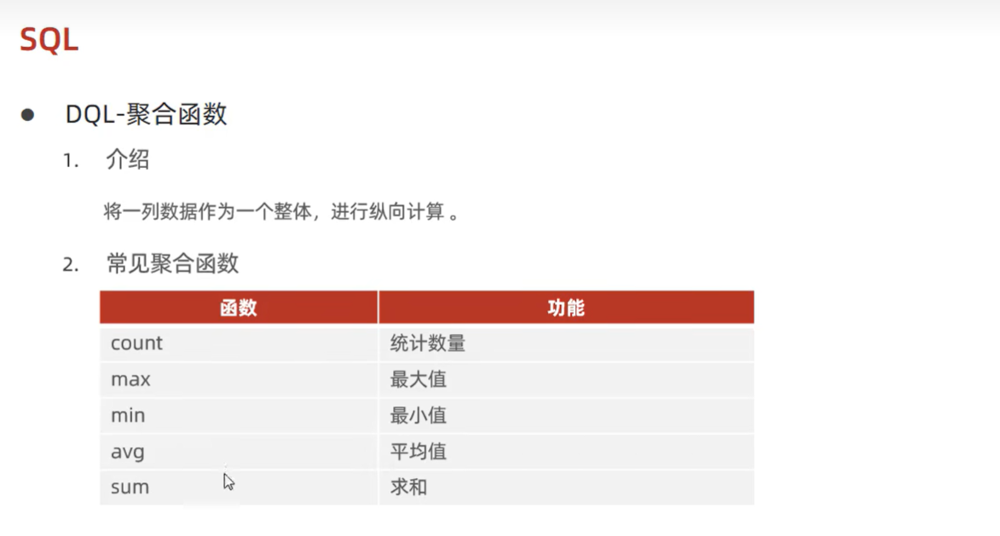

作用于某一列:

null值不参与计算

```mysql
--聚合函数
--1.统计企业员工数量
SELECT count(id)from emp ;
--2.统计企业员工平均年龄
SELECT avg(age)from emp;
3.统计最大年龄
select max(age)from emp1;
3.统计最小年龄
select min(age)from emp1;
--统计广州地区员工年龄之和
select sum(age) from emp1 where workaddress='广州';
```


##### 分组查询: group by


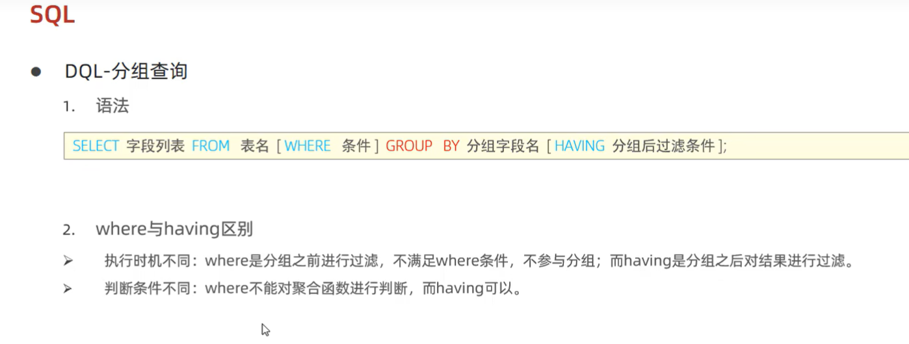

```mysql
--1.根剧性别分组
SELECT gender,count(*) from emp1 group by gender;
--求男女平均年龄
SELECT gender,avg(age) from emp1 group by gender;

--3.查询年龄小于45,并且根据公主地址分组,获取工作量大于3的员工
SELECT workaddress ,count(*)from emp1 where age<45 group by workaddress having count(*)>=3;
```

##### 排序查询:oder by

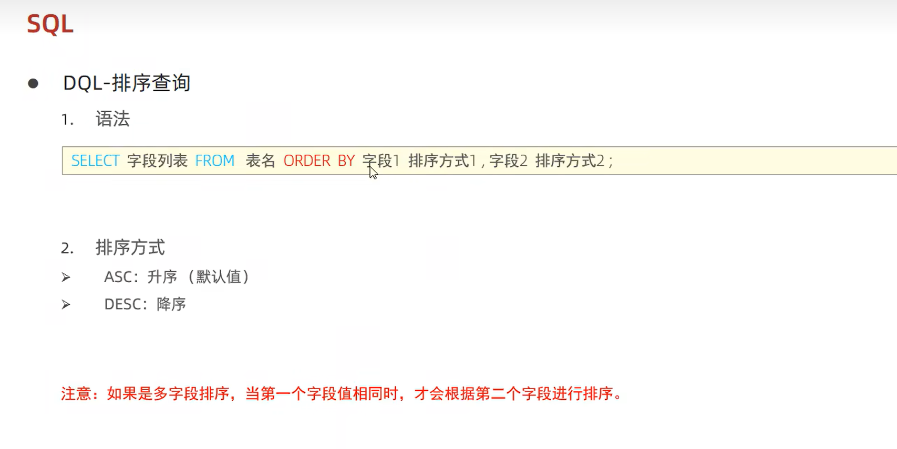

```mysql
--1.排序查询:升序,降序
--1.年龄升序牌员工
SELECT *from emp oder by age asc;
--2.年龄降序

SELECT *from emp1 order by age desc;
--3.根据年龄排序,年龄相同按入职时间降序
select * fromemp order by age acs,enttydata desc;
```

##### 分页查询:limit

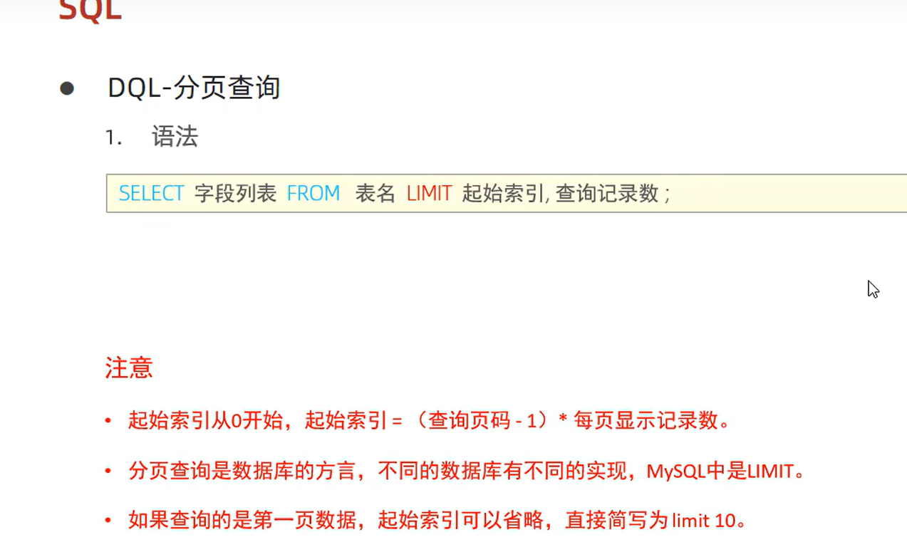

```mysql
--分页查询
--1.查询第一页员工数据,每页展示10条记录
select *from emp limit 0,10;
--2.查询第二页数据---->(页码数-1)*页展示记录
select *from emp limit 10,10;
```

##### dql执行顺序:

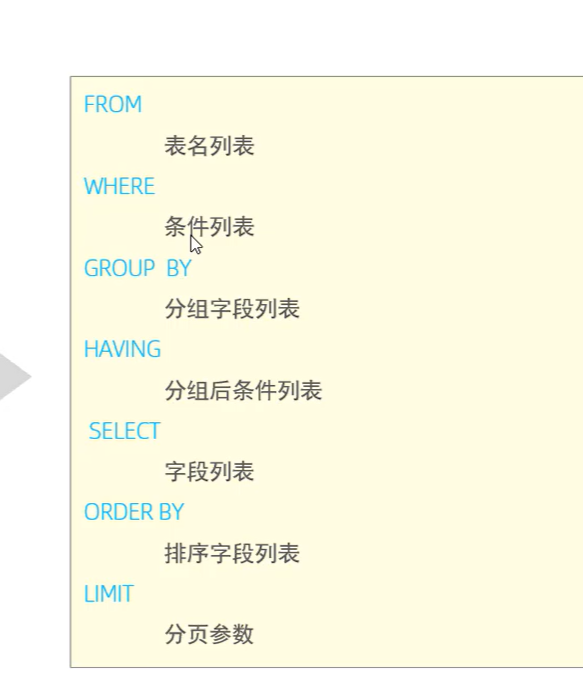

#### dcl

管理用户:

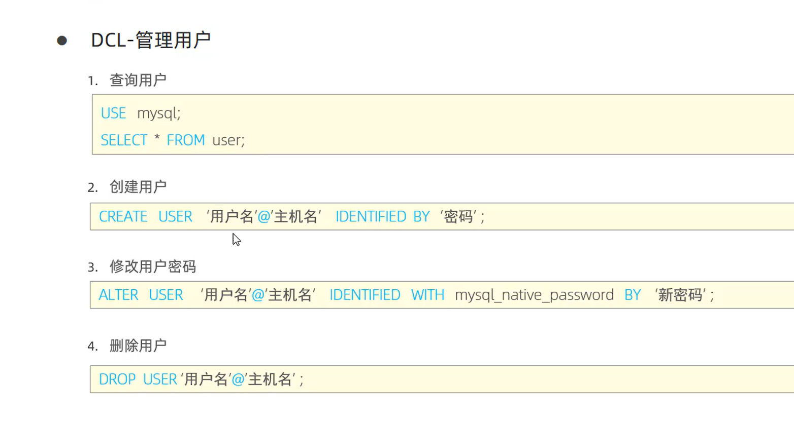

```mysql
--创建用户,只能够在当前主机访问密码123456;
--CREATE USER 'tortoise'@'localhost' IDENTIFIED BY '123456';
--创建用户tortoise014,可以在任意主集访问
CREATE USER 'tortoise014'@'%' IDENTIFIED BY '123456';
--改密码
ALTER user 'tortoise014'@'%' IDENTIFIED WITH mysql_native_password by '1234';
--删除'tortoise'@'localhost'
drop user 'tortoise'@'localhost';
```

#### 函数:

##### 字符串函数

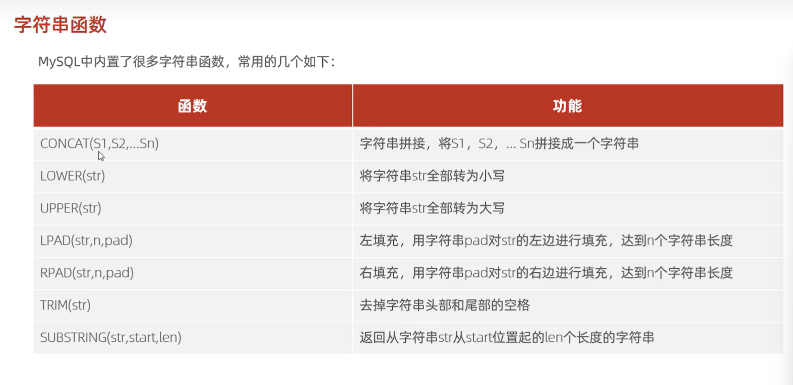

```mysql
--concat
select CONCAT('hello','mysql');--hellomysql;
--lower,全部是专为小写
SELECT lower('HELLO');
--upper全部是专为大写
select UPPER('hello');
--l坐填充
SELECT lpad('01',5,'-');
--lpad填充
SELECT rpad('01',5,'-');
--trim去除空格
SELECT trim(' Hello  mysql ');
--从str到len
--SUBSTRING('helllo mysql',1,5);

```

##### 数值函数

:

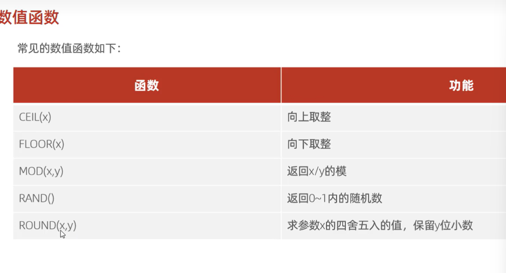

```mysql
--concat
select CONCAT('hello','mysql');--hellomysql;
--lower,全部是专为小写
SELECT lower('HELLO');
--upper全部是专为大写
select UPPER('hello');
--l坐填充
SELECT lpad('01',5,'-');
--lpad填充
SELECT rpad('01',5,'-');
--trim去除空格
SELECT trim(' Hello  mysql ');
--从str到len
--SUBSTRING('helllo mysql',1,5);
UPDATE emp1 set workno = lpad(workno,5,'0');
--ceil向上取整
SELECT ceil(1.1);
--floor向下取整
SELECT floor(1.1);
--mod取模
SELECT mod (5,4);

--rand随机数0-1
SELECT rand();


--round后面的是保留两位小数
SELECT round(2.344,2);
SELECT lpad(round(rand()*100000000,2),6,'0');

```

##### 日期函数:

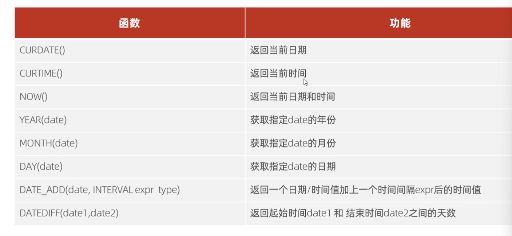

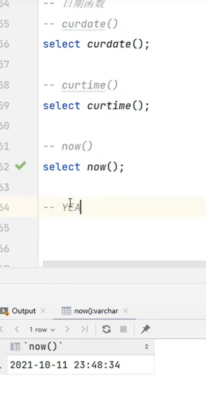


##### 流程控制函数:

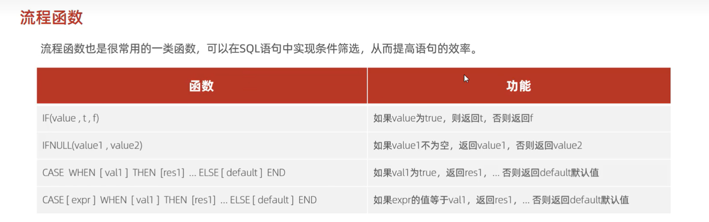

```mysql
--if
SELECT if (turn,'ok','error');
--IFNULL;第一个值不为null则
SELECT if ('ok','error');
--case when then else end;
SELECT
	name,
	(case workaddress when '广州' then '一线城市'else'二线城市'end)as '公主地址'
from emp1;
```

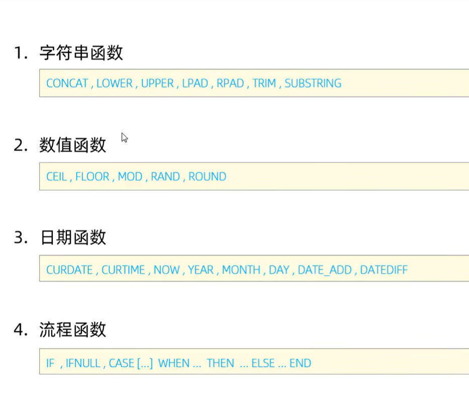

### 约束:


##### 概述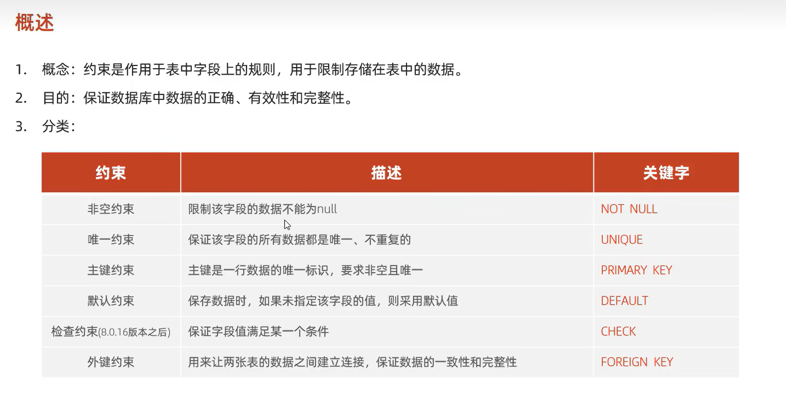

作用于表中字段上的,可以在创建表或者修改表的时候添加约束

演示:

主键约束加自动增长

```mysql
id int PRIMARY KEY auto_increment comment '主键',
```

非空加唯一

```
name varchar(10) not null UNIQUE comment '姓名',
```

范围

```
age int CHECK(age>0&&age<=120),
```

放入默认值

status char(1) default '1' ,

```
create table user(

id int PRIMARY KEY auto_increment comment '主键',
name varchar(10) not null UNIQUE comment '姓名',
age int CHECK(age>0&&age<=120),
status char(1) default '1' ,
gender char(1)
)comment '用户表';
--插入数据
insert into user(name,age,status,gender) values ('tom1',19,'1','男');
```

##### 外建联系:

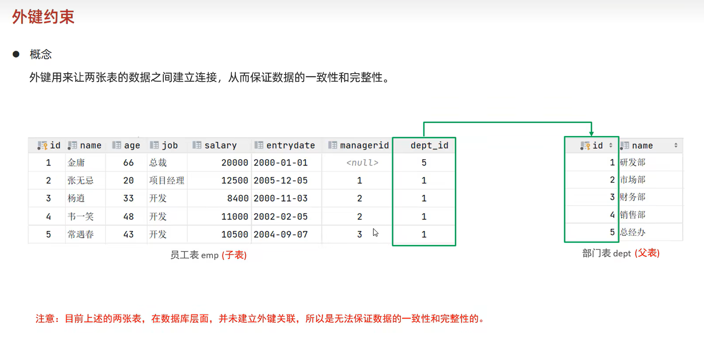

只存在逻辑关系.

##### 添加和删除外建:foreign key    REFERENCES

```mysql
	--添加外建
		ALTER table emp add CONSTRAINT fk_emp_dept_id FOREIGN key(dept_id) REFERENCES dept(id);
		
		--删除外建
		ALTER table emp drop foreign key fk_emp_dept_id;
```

##### 外建删除跟新行为:on update ;on delete;

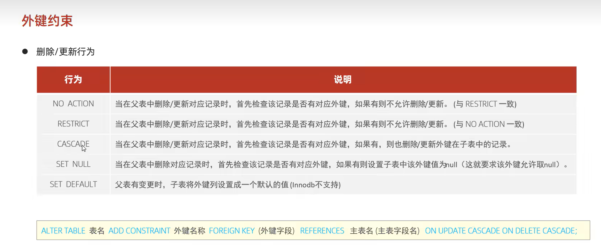

```mysql
	--外键的删除和更新行为
		ALTER table emp add CONSTRAINT fk_emp_dept_id FOREIGN key(dept_id) REFERENCES dept(id) on update cascade on delete CASCADE;
				--外键的删除和更新行为
		ALTER table emp add CONSTRAINT fk_emp_dept_id FOREIGN key(dept_id) REFERENCES dept(id) on update set null on delete set null;
```

##### 总结:

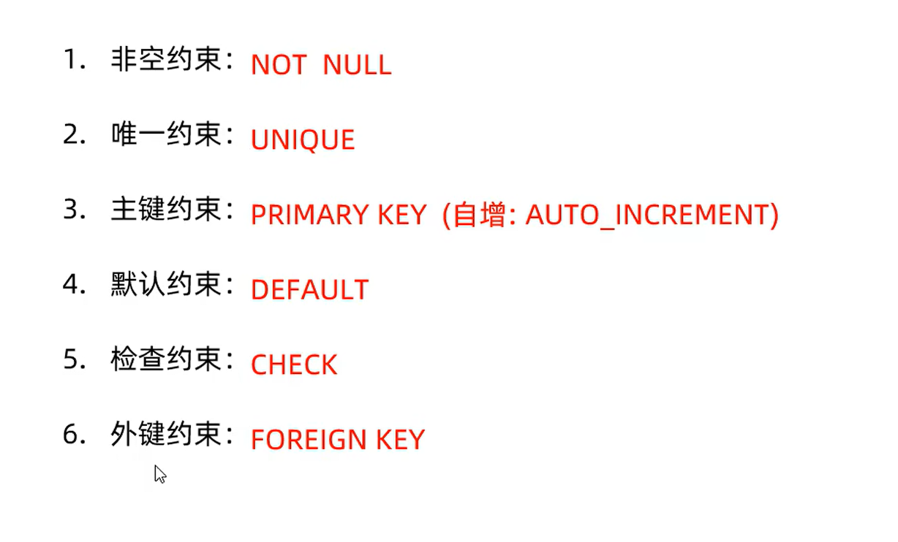


#### 多表查询:

##### 概述

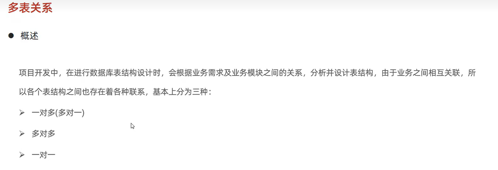

##### 一对多

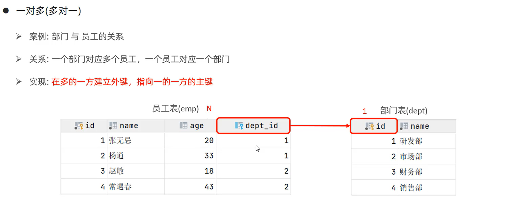

##### 多对多

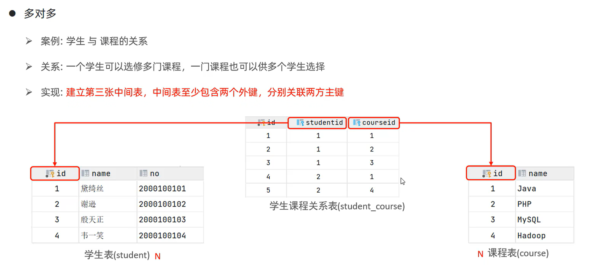

核心:靠中间表来维护关系

##### 一对一

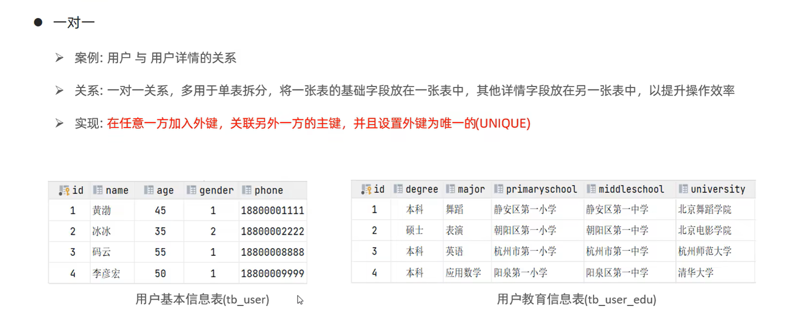


##### 多表查询:


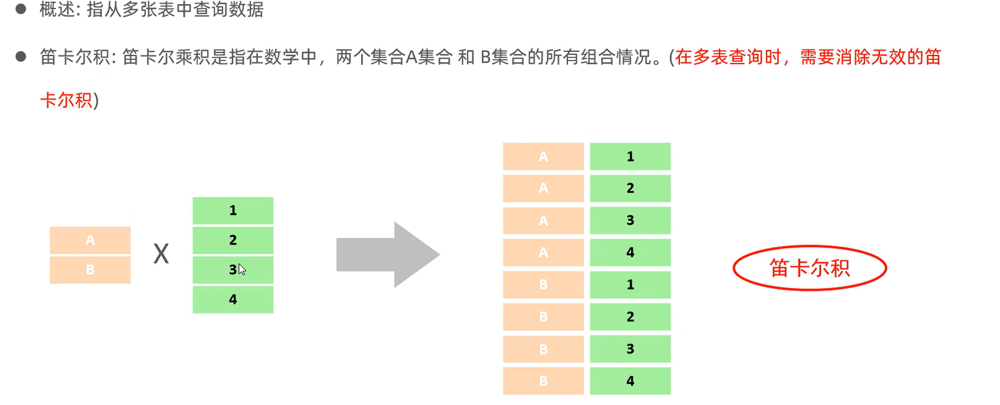

##### 去重：DISTINCT

消除笛卡尔积:

```mysql
-- 多表查询 -- 笛卡尔积
select DISTINCT* from emp , dept where emp.dept_id = dept.id;
```


##### 分类

##### 

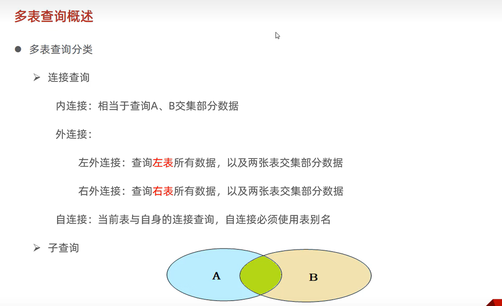


##### 内连接：

##### 显示join    on，隐式

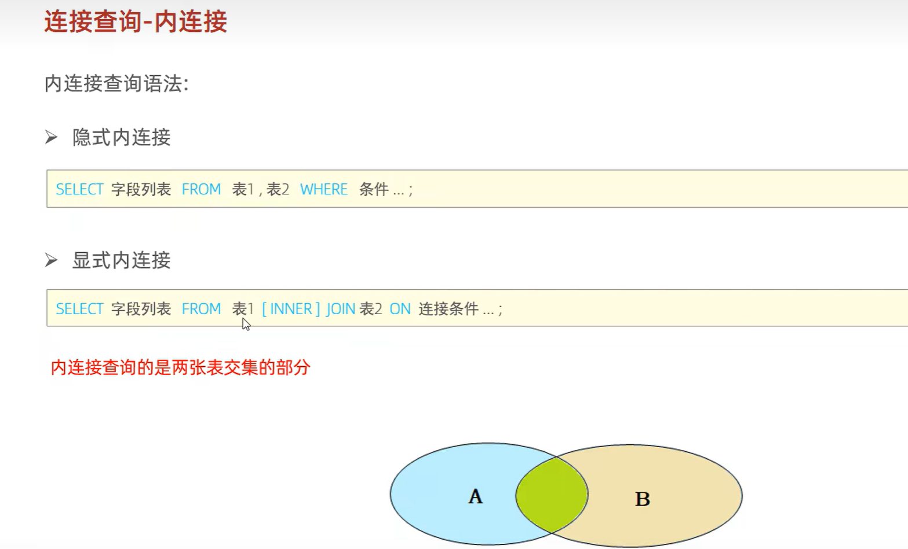


```mysql

-- 内连接演示
-- 1. 查询每一个员工的姓名 , 及关联的部门的名称 (隐式内连接实现)
-- 表结构: emp , dept
-- 连接条件: emp.dept_id = dept.id

SELECT emp.name,dept.name from emp ,dept where emp.dept_id=dept.id;

select e.name,d.name from emp e , dept d where e.dept_id = d.id;--起别名,起了之后就不能用原名了
		-- 2. 查询每一个员工的姓名 , 及关联的部门的名称 (显式内连接实现)  --- INNER JOIN ... ON ...
-- 表结构: emp , dept
-- 连接条件: emp.dept_id = dept.id
select e.name, d.name from emp e inner join dept d  on e.dept_id = d.id;

select e.name, d.name from emp e join dept d  on e.dept_id = d.id;
```

通过on来消除去重

##### 外连接:

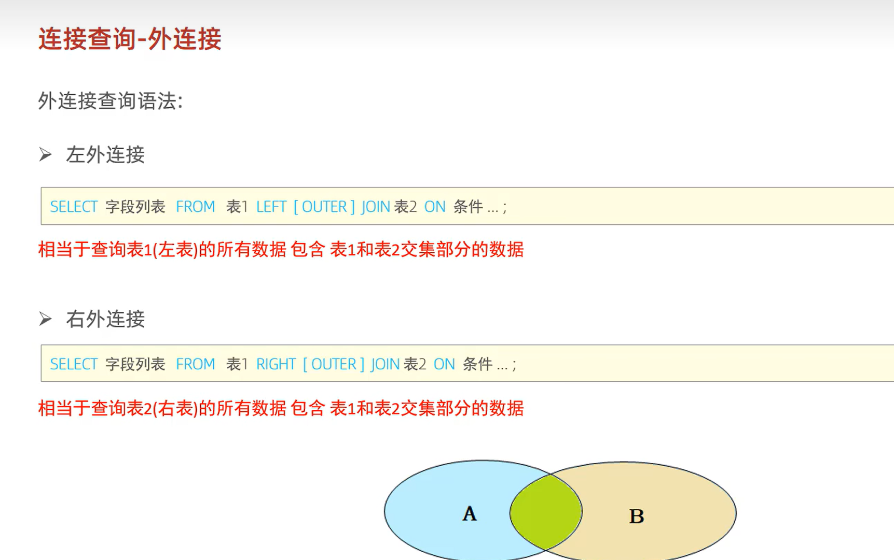

```mysql
		-- 外连接演示
-- 1. 查询emp表的所有数据, 和对应的部门信息(左外连接)
-- 表结构: emp, dept
-- 连接条件: emp.dept_id = dept.id

select e.*, d.name from emp e left outer join dept d on e.dept_id = d.id;

select e.*, d.name from emp e left join dept d on e.dept_id = d.id;


		
		-- 2. 查询dept表的所有数据, 和对应的员工信息(右外连接)

select d.*, e.* from emp e right outer join dept d on e.dept_id = d.id;

select d.*, e.* from dept d left outer join emp e on e.dept_id = d.id;

```


##### 自连接:


##### 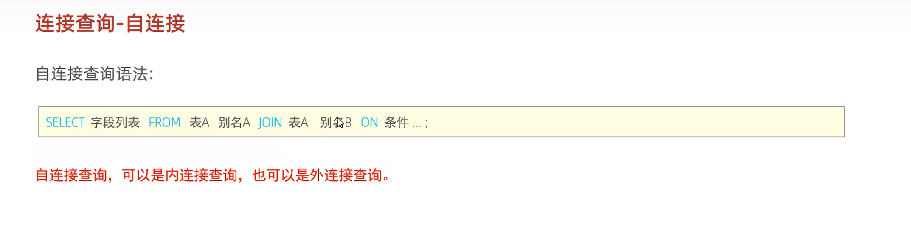

```mysql
-- 自连接
-- 1. 查询员工 及其 所属领导的名字
-- 表结构: emp

select a.name , b.name from emp a , emp b where a.managerid = b.id;

-- 2. 查询所有员工 emp 及其领导的名字 emp , 如果员工没有领导, 也需要查询出来
-- 表结构: emp a , emp b

select a.name '员工', b.name '领导' from emp a left join emp b on a.managerid = b.id;

```

一定要起别名

##### 联合查询:union all , union

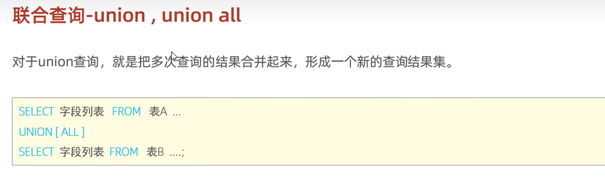

```mysql

-- union all , union
-- 1. 将薪资低于 5000 的员工 , 和 年龄大于 50 岁的员工全部查询出来.

select * from emp where salary < 5000
union all
select * from emp where age > 50;--直接合并
--去重--去掉all
select * from emp where salary < 5000
union
select * from emp where age > 50;
--查询字段要一致
```

#### 子查询:

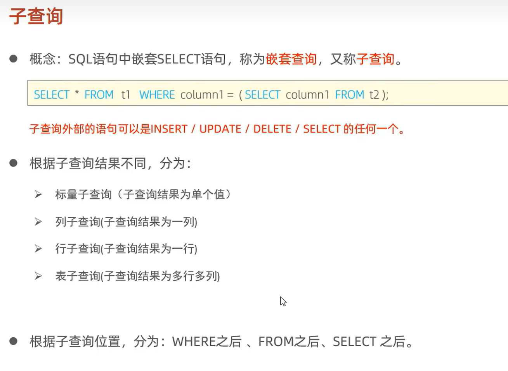

##### 标量子查询

```
-- 标量子查询
-- 1. 查询 "销售部" 的所有员工信息
-- a. 查询 "销售部" 部门ID
select id from dept where name = '销售部';

-- b. 根据销售部部门ID, 查询员工信息
select * from emp where dept_id = (select id from dept where name = '销售部');


		
		
		
		
-- 2. 查询在 "方东白" 入职之后的员工信息
-- a. 查询 方东白 的入职日期
SELECT entrydate from emp where name='方东白';

-- b. 查询指定入职日期之后入职的员工信息
SELECT *from emp where		entrydate >(SELECT entrydate from emp where name='方东白');
```

##### 列子查询:

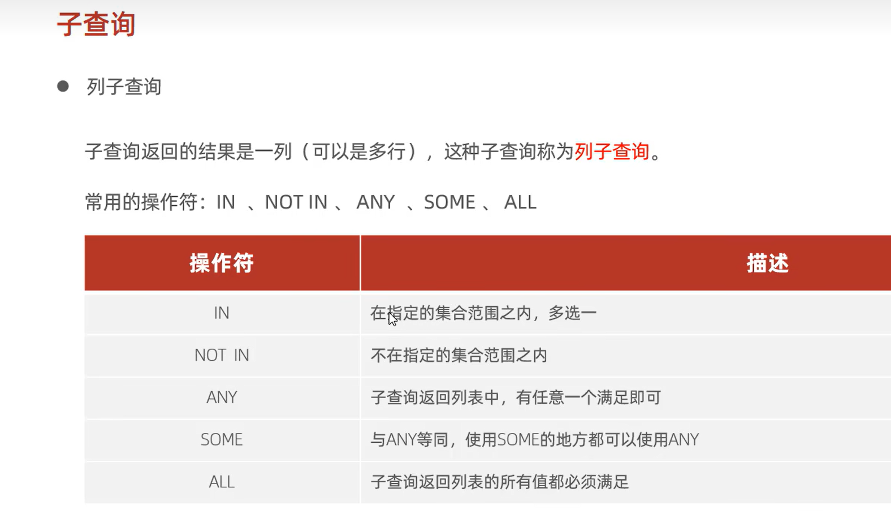

##### all:返回的所有都要满足

##### any/some：返回的只要满足一个就行

```mysql
-- 列子查询
-- 1. 查询 "销售部" 和 "市场部" 的所有员工信息
-- a. 查询 "销售部" 和 "市场部" 的部门ID
select id from dept where name = '销售部' or name = '市场部';

-- b. 根据部门ID, 查询员工信息
select * from emp where dept_id in (select id from dept where name = '销售部' or name = '市场部');


-- 2. 查询比 财务部 所有人工资都高的员工信息
-- a. 查询所有 财务部 人员工资
select id from dept where name = '财务部';

select salary from emp where dept_id = (select id from dept where name = '财务部');

-- b. 比 财务部 所有人工资都高的员工信息
select * from emp where salary > all ( select salary from emp where dept_id = (select id from dept where name = '财务部') );


-- 3. 查询比研发部其中任意一人工资高的员工信息
-- a. 查询研发部所有人工资
select salary from emp where dept_id = (select id from dept where name = '研发部');

-- b. 比研发部其中任意一人工资高的员工信息
select * from emp where salary > some ( select salary from emp where dept_id = (select id from dept where name = '研发部') );


```

##### 行子查询：

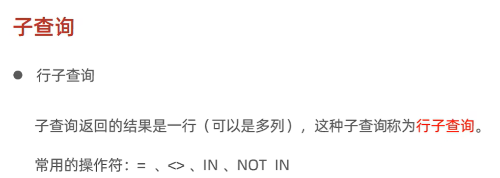

```mysql

-- 行子查询
-- 1. 查询与 "张无忌" 的薪资及直属领导相同的员工信息 ;
-- a. 查询 "张无忌" 的薪资及直属领导
select salary, managerid from emp where name = '张无忌';

-- b. 查询与 "张无忌" 的薪资及直属领导相同的员工信息 ;
select * from emp where (salary,managerid) = (select salary, managerid from emp where name = '张无忌');

```

##### 表子查询：in


```mysql
-- 表子查询
-- 1. 查询与 "鹿杖客" , "宋远桥" 的职位和薪资相同的员工信息
-- a. 查询 "鹿杖客" , "宋远桥" 的职位和薪资
select job, salary from emp where name = '鹿杖客' or name = '宋远桥';

-- b. 查询与 "鹿杖客" , "宋远桥" 的职位和薪资相同的员工信息
select * from emp where (job,salary) in ( select job, salary from emp where name = '鹿杖客' or name = '宋远桥' );


-- 2. 查询入职日期是 "2006-01-01" 之后的员工信息 , 及其部门信息
-- a. 入职日期是 "2006-01-01" 之后的员工信息
select * from emp where entrydate > '2006-01-01';

-- b. 查询这部分员工, 对应的部门信息;

--用一个中间表来表示
select e.*, d.* from (select * from emp where entrydate > '2006-01-01') e left join dept d on e.dept_id = d.id ;
```

##### 总结:

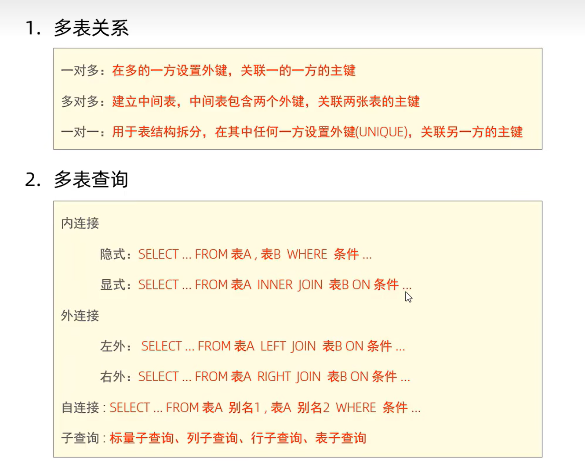

#### 事务:

##### 概述

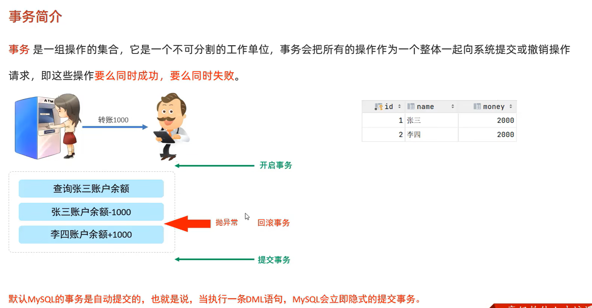

##### 事务操作:

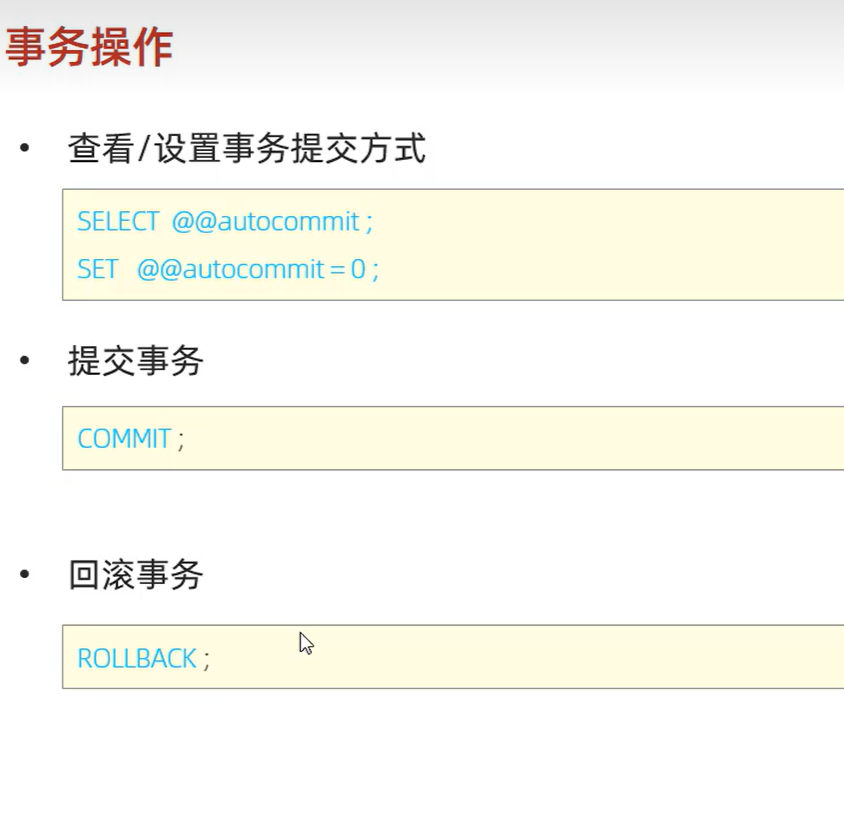

```mysql
select @@autocommit;

set @@autocommit = 0; -- 设置为手动提交

-- 转账操作 (张三给李四转账1000)
-- 1. 查询张三账户余额
select * from account where name = '张三';

-- 2. 将张三账户余额-1000
update account set money = money - 1000 where name = '张三';

程序执行报错 ...

-- 3. 将李四账户余额+1000
update account set money = money + 1000 where name = '李四';


-- 提交事务
--如果正常完成
commit;

-- 回滚事务
--如果出现异常
rollback ;
```

第二种:

```mysql
-- 方式二
-- 转账操作 (张三给李四转账1000)
start transaction ;

-- 1. 查询张三账户余额
select * from account where name = '张三';

-- 2. 将张三账户余额-1000
update account set money = money - 1000 where name = '张三';

程序执行报错 ...

-- 3. 将李四账户余额+1000
update account set money = money + 1000 where name = '李四';


-- 提交事务
commit;

-- 回滚事务
rollback;

```

##### 四大特性:

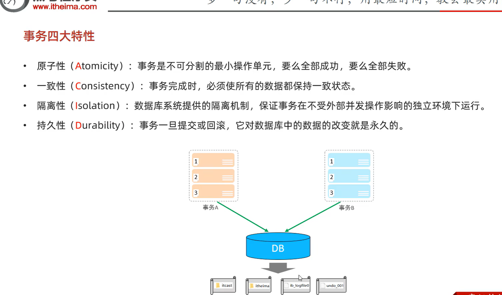

##### 并发事务问题:

1. 脏读
2. 不可重复读
3. 幻读

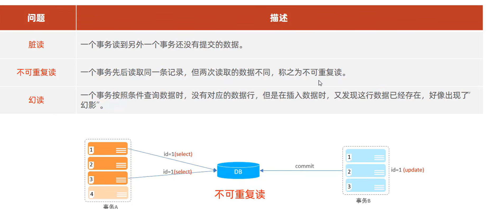

##### 隔离级别

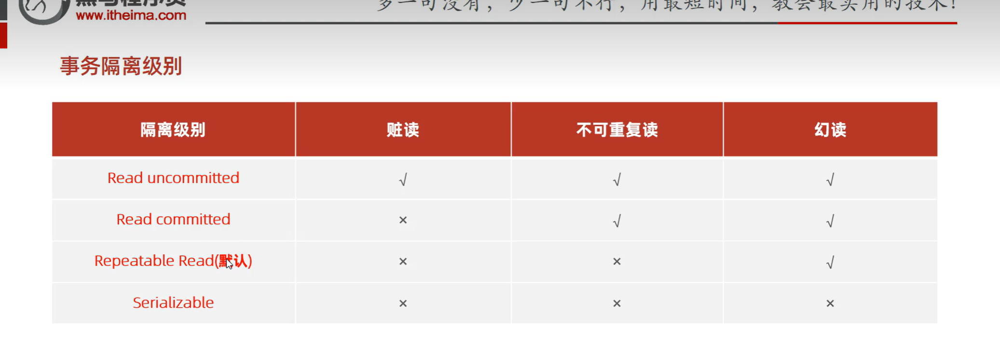

##### 查看和设置级别:

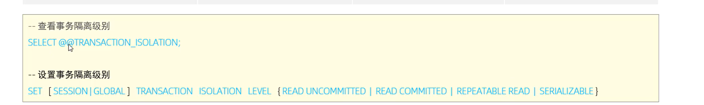

事务隔离级别更高安全更高但是性能越低


#### 总结:

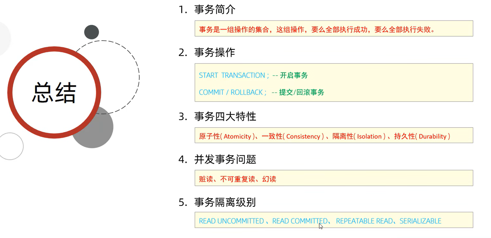
